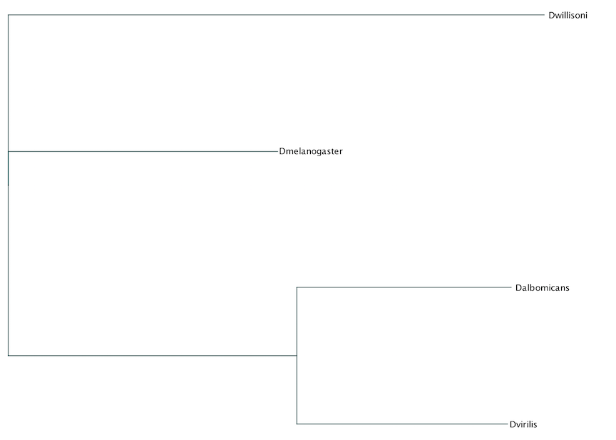
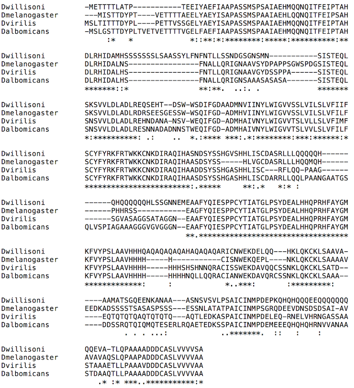

% WGS Wizard
% Maya Gosztyla

# What is BLAST?
 - Basic local alignment search tool
 - Used compare DNA, RNA, or protein sequences
 - Important for finding **homologs** (genes with a common origin in different species)
 
# The WGS database in NCBI
 - Stands for Whole Genome Shotgun
 - "Genome assemblies of incomplete genomes or incomplete chromosomes of prokaryotes or eukaryotes that are generally being sequenced by a whole genome shotgun strategy." -NCBI
 - Useful for looking at species that have not been thoroughly studied before.
 - But, genes are often un-annotated or incorrectly annotated (especially for insects).
 
# How my undergrad lab did their WGS BLAST
<sub>
1.  Look up a gene of interest and find the protein sequence.
2.  Copy protein sequence into NCBI tBLASTn program.
3.  Enter species name of interest (typically one at a time).
4.  Execute BLAST.
5.  Open the WGS scaffold of potential hit.
6.  Copy scaffold into EMBOSS Sixpack translation tool.
7.  Find the open reading frame that includes the sequence of interest.
8.  For the first exon, keep going upstream until you reach a stop, and then backtrack to find the first potential starting methionine.
9.  For the other end of exon 1, look for a splice site: GT(A/G)AGT and record down what nucleotide is part of the splice codon.
10. At the beginning of exon 2, look for the other splice site: (C/T)AG/(A/G) and record the two nucleotides on the right of AG in the splice site and combine it with the single nucleotide on the first exon splice site to determine the splice codon amino acid.
11. Continue on with exon 2 until a stop codon is reached.
12. Put both exons together along with splice codon and translate it.
13. Put the nucleotides and amino acids in FastA format and record in an excel sheet.
#### Basically, lots of clicking around to different website and painstakingly searching for codons/splice sites by hand! Often took 15+ minutes to find a single gene in one species (and we did HUNDREDS of these).

# What is WGS Wizard?
WGS Wizard automates the process of finding a gene sequence from a WGS BLAST result. This enhances efficiency (~15-30 seconds per query!) and also eliminates human error/bias while enhancing reproducibility.
- Step 1: Import packackes (mainly built on Biopython)
- Step 2: Define the WGS database
- Step 3: Run the BLAST
- Step 4: Figure out the gene sequence
Step 4 is the hard part! Focusing on that for this presentation.

# Getting the scaffold and ordering exons
```python
def wgsseq(email: str, blast: list):
    """
    :param email: Your email address (required for Entrez queries).
    :param blast: A list of BLAST results.
    :return: A Bio.Seq.Seq object containing the complete gene sequence.
    """
    #Get scaffold sequence
    Entrez.email = email
    accession = blast[0].alignments[0].accession
    with Entrez.efetch(db="nucleotide", rettype="gb", retmode="text", id=accession) as handle:
        seq_record = SeqIO.read(handle, "gb")
    #Put exons in proper order
    if blast[0].alignments[0].hsps[0].sbjct_start < blast[0].alignments[0].hsps[1].sbjct_start:
        exon1 = blast[0].alignments[0].hsps[0]
        exon2 = blast[0].alignments[0].hsps[1]
    else:
        exon1 = blast[0].alignments[0].hsps[1]
        exon2 = blast[0].alignments[0].hsps[0]
```

# Finding exon 1
```python
    #Find the first upstream in-frame stop codon
    e1upstream = seq_record.seq[0 : exon1.sbjct_start + 4]
    e1stop = e1upstream.rfind('TAA' or 'TAG' or 'TGA')
    while (exon1.sbjct_start - 1 - e1stop) % 3 != 0 and e1stop != exon1.sbjct_start:
        e1stop = e1upstream[0 : e1stop].rfind('TAA' or 'TAG' or 'TGA')
    #Find the first in-frame start codon after the stop
    e1start = e1upstream[e1stop : ].find('ATG')
    if e1start != -1:
        e1start = e1start + e1stop
        while (exon1.sbjct_start - 1 - e1start) % 3 != 0 and e1start != exon1.sbjct_start:
            e1start = e1upstream[e1stop + e1start + 1 : ].find('ATG') + e1stop + e1start + 1
    else:
        e1start = e1stop + 3
    #Find the exon1 splice site
    e1downstream = seq_record.seq[exon1.sbjct_end - 6 :]
    e1splice = e1downstream.find('GTAAGT' or 'GTGAGT')
    e1splice = e1splice + exon1.sbjct_end - 6
    exon1_complete = seq_record.seq[e1start : e1splice]
```

# Finding exon 2
```python
    #Find the exon2 splice site
    e2upstream = seq_record.seq[0 : exon2.sbjct_start + 5]
    e2splice = e2upstream.rfind('CAGA' or 'CAGG' or 'TAGA' or 'TAGG') + 3
    geneseq = exon1_complete + seq_record.seq[e2splice :]
    #Find the stop codon
    length = len(geneseq.translate(to_stop = True)) * 3
    geneseq = geneseq[0 : length + 3]
    return geneseq
```

# Example results
I BLASTed the Drosophila melanogaster Commisureless gene against 3 other fly species (virilis, willisoni, and albomicans).
Time to complete using old method: ~1 hour
Time to complete using WGS Wizard: ~2 minutes


# Example results (cont.)


# Current Limitations
WGS Wizard still has lots of areas I want to improve! Currently the program only works for genes that satisfy the following requirements:
- Must have exactly 2 exons
- Both exons must appear on the same WGS scaffold
- The species must be in the Drosophila genus, or use the same splice site motifs as Drosophila
## Any questions???
